# Битоническая сортировка на OpenCL

## Содержание

- [Введение](#введение)
- [Реализация на CPU](#реализация-на-cpu)
- [Наивная релизация на GPU](#наивная-реализация-на-gpu)
- [Реализация с использованием локальной памяти на GPU](#реализация-с-использованием-локальной-памяти-на-gpu)

## Введение

### Характеристики тестирующего оборудования

OS: Fedora Linux 43 (Workstation Edition) x86_64
CPU: 13th Gen Intel(R) Core(TM) i5-13500H (16) @ 4.70 GHz
GPU: Intel Iris Xe Graphics @ 1.45 GHz [Integrated]
Memory: 15.24 GiB

### Использованные утилиты

Профилировщик [Perf](https://perfwiki.github.io/main/)
Профилировщик [Intel Vtune Profiler](https://www.intel.com/content/www/us/en/developer/tools/oneapi/vtune-profiler-download.html)

### Об алгоритме

В этой работе мы хотим реализовать алгоритм битонической сортировки на GPU. 

Алгоритм основан на сортировке битонических последовательностей. Такой последовательностью называется последовательность, которая сначала монотонно не убывает, а затем монотонно не возрастает. 

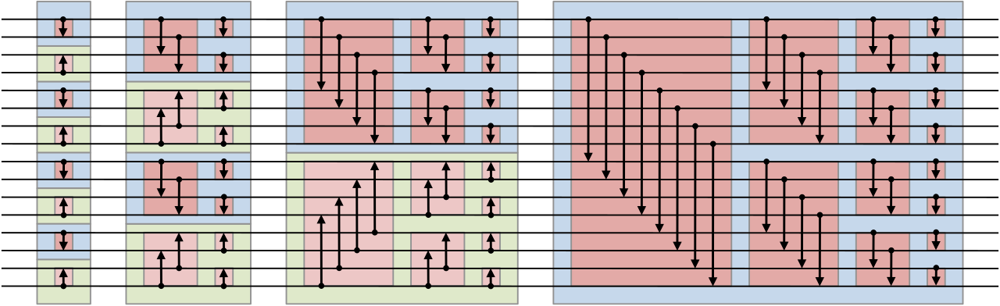

На рисунке изображена битонная сортировочная сеть для 16 элементов, которая сортирует множество по возрастанию. Стрелки изображают компараторы, которые сравнивают два числа и при необходимости меняют их местами таким образом, чтобы направление стрелки указывало на большее число.

Прежде чем читать дальше, полезно понять, как работает этот алгоритм. Приятного прочтения!

## Реализация на CPU

### Рекурсия
Перед тем, как реализовывать сортировку на GPU, мы решили разобраться в самом алгоритме. Первым шагом была рекурсивная реализация алгоритма на CPU.

```cpp
void cpu_comp_and_swap(int& first, int& second, Direction direction)
{
    if ((first > second) == (direction == Direction::Ascending)) { std::swap(first, second); }
}

void cpu_merge(std::vector<int>::iterator begin, std::vector<int>::iterator end,
               Direction direction)
{
    std::ptrdiff_t size = end - begin;
    if (size <= 1) { return; }

    std::ptrdiff_t half = size / 2;

    for (std::ptrdiff_t i = 0; i < half; ++i)
    {
        cpu_comp_and_swap(begin[i], begin[half + i], direction);
    }

    cpu_merge(begin, begin + half, direction);
    cpu_merge(begin + half, end, direction);
}

void cpu_sort_recursive(std::vector<int>::iterator begin, std::vector<int>::iterator end,
                        Direction direction)
{
    std::ptrdiff_t size = end - begin;
    if (size <= 1) { return; }

    std::ptrdiff_t half = size / 2;

    cpu_sort_recursive(begin, begin + half, Direction::Ascending);
    cpu_sort_recursive(begin + half, end, Direction::Descending);

    cpu_merge(begin, end, direction);
}
```

Этот несложный код помог разобраться в самом алгоритме и дальше мы начали думать о том, как безболезненно переложить алгоритм с CPU на GPU.

### Итеративная (наивная)

Так как рекурсия в OpenCL не поддерживается, следующим очевидным шагом стало написание итеративной версии сортировки.

```cpp
void cpu_comp_and_swap(int& first, int& second, Direction direction)
{
    if ((first > second) == (direction == Direction::Ascending)) { std::swap(first, second); }
}

void cpu_sort_iterative_0(std::vector<int>::iterator begin, std::vector<int>::iterator end,
                          Direction direction)
{
    std::ptrdiff_t size = end - begin;
    if (size <= 1) { return; }

    for (std::size_t block_size = 2; block_size <= size; block_size *= 2)
    {
        for (std::size_t dist = block_size / 2; dist > 0; dist /= 2)
        {
            for (std::size_t pos = 0; pos < size; ++pos)
            {
                std::size_t partner = pos ^ dist;
                if (partner > pos)
                {
                    bool use_original_direction = (pos & block_size) == 0;
                    Direction local_direction = use_original_direction ? direction : !direction;

                    details::cpu_comp_and_swap(begin[pos], begin[partner], local_direction);
                }
            }
        }
    }
}
```

Приведу некоторые пояснения по нетривиальным моментам:

1) ```for (std::size_t block_size = 2; block_size <= size; block_size *= 2)```

На начальном этапе каждый элемент массива можно рассматривать как отдельную битоническую последовательность длиной 1, которая одновременно является и возрастающей, и убывающей. Мы хотим слить имеющиеся битонические последовательности в новые последовательности длины 2, потом 4 и так далее.
Таким образом, block_size показывает размер битонической последовательности, которую мы хотим получить в результате слияния.

2) ```for (std::size_t dist = block_size / 2; dist > 0; dist /= 2)```

Этот цикл реализует процесс слияния битонических последовательностей в битонические последовательности большего размера. dist определяет расстояние между элементами, которые мы сравниваем и меняем местами на текущем шаге.

3) ```for (std::size_t pos = 0; pos < size; ++pos)```

Этот цикл проходит по всем элементам массива и для каждой позиции определяет, нужно ли выполнить обмен на текущем этапе слияния.

4) ```std::size_t partner = pos ^ dist;```

partner - индекс элемента, с которым мы хотим сравнить (и, возможно, обменять) элемент с индексом pos.

Почему xor? 
xor гарантирует, что pos и partner находятся в одном блоке размера $dist * 2$, при этом они расположены на расстоянии dist друг от друга:

Если бит на позиции dist в pos равен 0 (первая половина блока), то xor устанавливает его в 1, что эквивалентно сложению: ```partner = pos + dist```

Если бит равен 1 (вторая половина блока), то xor сбрасывает его в 0, что эквивалентно вычитанию: ```partner = pos - dist```

5) ```if (partner > pos)```

Если в предыдущем шаге мы попали в ситуацию ```partner = pos - dist```, то эта ситуация уже обрабатывалась ранее, а значит нет смысла сравнивать эти элементы снова.

6) ```bool use_original_direction = (pos & block_size) == 0;```

Так как мы хотим получить битоническую последовательность в результате слияния, мы должны чередовать направление сортировки. 
Например, если мы сортируем массив в порядке возрастания, то первые две битонические последовательности нужно слить в одну возрастающую, вторые две - в одну убывающую, потом снова в возрастающую и так далее.

Почему "побитовое и"?
Бит, соответствующий ```block_size``` (```block_size``` является степенью двойки), делит весь массив на чередующиеся зоны размера ```block_size```:

Если бит равен 0: элемент находится в первой части объединяемого блока. Здесь мы сохраняем исходное направление ```direction```.

Если бит равен 1: Элемент находится во второй части. Здесь мы должны инвертировать направление (```!direction```), чтобы эта часть была отсортирована противоположно первой.

### Сравнение

В целом, получившийся алгоритм уже можно было переложить на OpenCL, но перед этим мы заметили странную, на первый взгляд, вещь. Почему-то наша итеративная сортировка работала медленнее, чем рекурсивная.

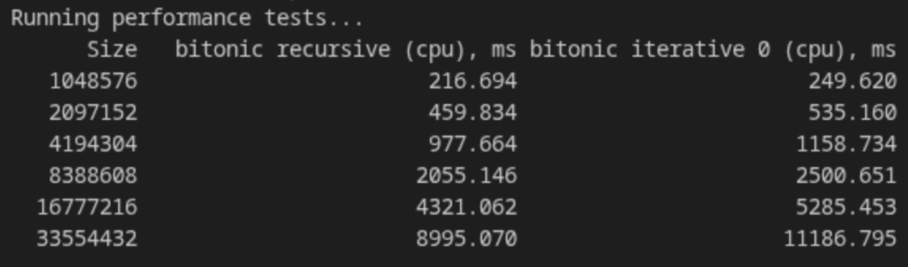

Обычно итеративные варианты алгоритмов работают быстрее рекурсивных из-за накладных расходов на рекурсию, это нас и насторожило! Поэтому мы начали профилировать, используя [Perf](https://perfwiki.github.io/main/).

Perf запускался со следующими флагами:
```sh
perf stat -e cpu_core/cycles/,cpu_core/instructions/,cpu_core/branches/,cpu_core/branch-misses/,cpu_core/cache-references/,cpu_core/cache-misses/ --repeat=5 <путь_до_исходника>
```

Профиль рекурсивной реализации:
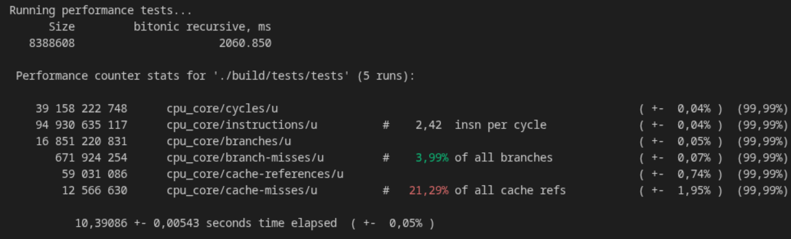

Профиль итеративной реализации:
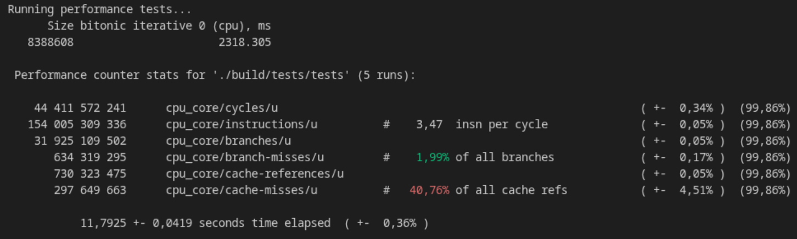

Нетрудно заметить, что количество тактов процессора, инструкций и ветвлений заметно увеличилось. Мы сделали предположение, что во всем виновата вот эта проверка: ```if (partner > pos)```. Действительно, может быть мы можем избежать лишнего перебора тех индексов ```pos```, для которых индекс ```partner``` меньше? Таким образом мы пришли к следующему итеративному варианту.

### Итеративная (без лишнего перебора)

```cpp
void cpu_sort_iterative_1(std::vector<int>::iterator begin, std::vector<int>::iterator end,
                        Direction direction)
{
    std::ptrdiff_t size = end - begin;
    if (size <= 1) { return; }

    for (std::size_t block_size = 2; block_size <= size; block_size *= 2)
    {
        for (std::size_t dist = block_size / 2; dist > 0; dist /= 2)
        {
            for (std::size_t block_idx = 0; block_idx < size / dist; block_idx += 2)
            {
                for (std::size_t pos = block_idx * dist; pos < block_idx * dist + dist; ++pos)
                {
                    std::size_t partner = pos ^ dist;

                    bool use_original_direction = (pos & block_size) == 0;
                    Direction local_direction = use_original_direction ? direction : !direction;

                    details::cpu_comp_and_swap(begin[pos], begin[partner], local_direction);
                }
            }
        }
    }
}
```

Теперь мы перебираем не все индексы ```pos```, а только те, для которых ```partner``` больше ```pos``` (которых ровно в  2 раза меньше!!!). Таким образом мы избавились от ```if```, но приобрели новый ```for```.

Тем не менее, алгоритм заметно ускорился:

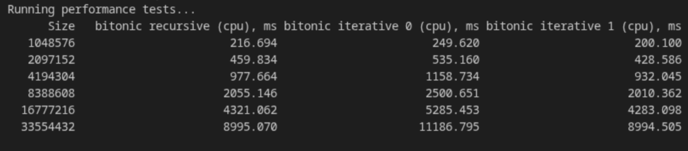

Профиль новой реализации:

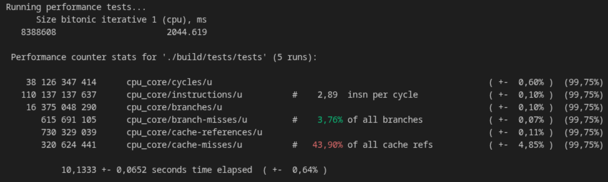

Количество тактов процессора и ветвлений теперь стало примерно такое же, как и в рекурсивной реализации, чему мы конечно же очень радуемся. 

Но тут же сталкиваемся с новой проблемой. Если в изначальном итеративном варианте мы могли внутренний цикл (по ```pos```) заменить на kernel и очень приятно получить версию для GPU, то в новом варианте мы получили два цикла, и не очень понятно что с ними делать. 

Попытаемся свернуть два цикла в один.

### Итеративная (с одним циклом)

Давайте попробуем проитерировать pos от ```0``` до ```array_size / 2```, а потом пересчитать pos так, чтобы покрыть весь массив, и причем только те части, в которых ```pos``` < ```partner```.

```cpp
void cpu_sort_iterative_2(std::vector<int>::iterator begin, std::vector<int>::iterator end,
                          Direction direction)
{
    std::ptrdiff_t size = end - begin;
    if (size <= 1) { return; }

    int dir = static_cast<int>(direction);

    for (std::size_t block_size = 2; block_size <= size; block_size *= 2)
    {
        for (std::size_t dist = block_size / 2; dist > 0; dist /= 2)
        {
            for (std::size_t pos = 0; pos < size / 2; ++pos)
            {
                std::size_t block_index = pos / dist;
                std::size_t correct_pos = pos + block_index * dist;

                std::size_t partner = correct_pos ^ dist;

                bool use_reversed_direction = (correct_pos & block_size) != 0;
                int local_direction = dir ^ use_reversed_direction;

                details::cpu_comp_and_swap(begin[correct_pos], begin[partner], local_direction);
            }
        }
    }
}
```

Теперь кажется, что эту реализацию можно очень удобно переложить на GPU. Поэтому дополнительно уберем ветвление при выборе ```local_direction```, используя ```xor```.

Измерив время на всякий случай... получим интересные результаты:

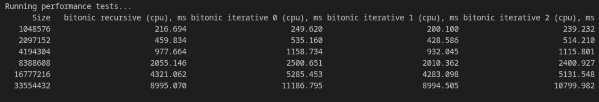

Время алгоритма опять увеличилось. Давайте соберем профиль и попробуем понять, что же не так.

Профиль:

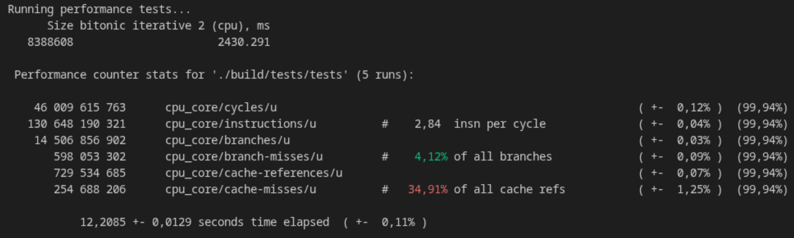

Видно, что количество тактов и инструкций увеличилось по сравнению с предыдущим вариантом. Наверное, единственное, из-за чего это могло произойти - новые инструкции в пересчёте ```pos```:

```cpp
std::size_t block_index = pos / dist;
std::size_t correct_pos = pos + block_index * dist;
```

Мы видим умножение и деление, которые являются непростыми инструкциями для процессора. Попробуем заменить их.

### Итеративная (итог)

Теперь будем итерироваться не по абсолютным значениям, а по степеням двойки, чтобы умножение и деление заменить на сдвиги, которые значительно быстрее.

Получим такую интересную функцию (к сожалению, менее приятную для чтения, чем изначально)

```cpp
void cpu_sort_iterative_3(std::vector<int>::iterator begin, std::vector<int>::iterator end,
                          Direction direction)
{
    std::ptrdiff_t size = end - begin;
    if (size <= 1) { return; }

    std::size_t size_log = log2(size);

    int dir = static_cast<int>(direction);

    for (std::size_t block_size_log = 1; block_size_log <= size_log; block_size_log += 1)
    {
        std::size_t block_size = 1ul << block_size_log;

        for (int dist_log = block_size_log - 1; dist_log >= 0; dist_log -= 1)
        {
            std::size_t dist = 1ul << dist_log;
            
            for (std::size_t pos = 0; pos < size / 2; ++pos)
            {
                std::size_t block_index = pos >> dist_log;
                std::size_t correct_pos = pos + (block_index << dist_log);

                std::size_t partner = correct_pos ^ dist;

                bool use_reversed_direction = (correct_pos & block_size) != 0;
                int local_direction = dir ^ use_reversed_direction;

                details::cpu_comp_and_swap(begin[correct_pos], begin[partner], local_direction);
            }
        }
    }
}
```

И действительно, наша оптимизация уменьшила общее количество тактов процессора:

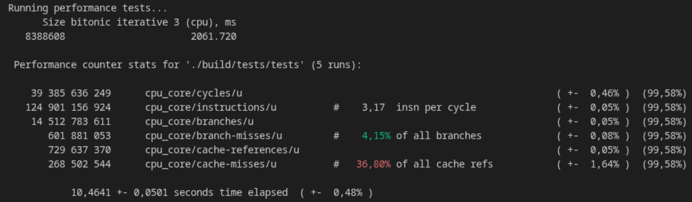


Измерив время работы каждой из предыдущих функций получим такой результат:

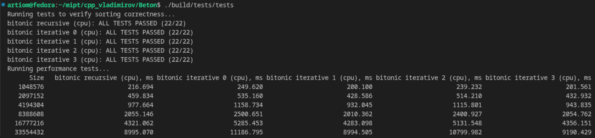

Итоговая функция ```cpu_sort_iterative_3``` работает сравнимо по скорости с функцией ```cpu_sort_iterative_1``` (с двумя циклами), но итоговый вариант можно намного приятнее переложить на GPU, в отличие от версии с двумя циклами.

Займёмся этим!

## Наивная реализация на GPU

Интересно будет написать три варианта наивной сортировки на GPU, аналогичные cpu_sort_iterative_0, cpu_sort_iterative_2, cpu_sort_iterative_3 и сравнить их по производительности. Действительно ли полезными оказались придуманные оптимизации?

Для удобства приводим таблицу с основными отличиями:

| Функция              | Количество if на каждую итерацию цикла | Сложные вычисления |
|----------------------|----------------------------------------|--------------------|
| cpu_sort_iterative_0 | 3                                      | Нет                |
| cpu_sort_iterative_2 | 1                                      | Да                 |
| cpu_sort_iterative_3 | 0                                      | Нет                |

Кернела на OpenCL и хостовый код практически ничем не будут отличаться от итеративных функий, но для полноты приведу код трёх получившихся кернелов, которые заменяют внутренний цикл по ```pos```.

Кернел, аналогичный ```cpu_sort_iterative_0```:
```cpp
__kernel void bitonic_step_naive(__global int* array, const uint block_size, const uint dist,
                                 int direction)
{
    uint pos = get_global_id(0);

    uint partner = pos ^ dist;
    if (partner < pos) { return; }

    int use_reversed_direction = (pos & block_size) != 0;
    int local_direction = direction ^ use_reversed_direction;

    COMP_AND_SWAP(array[pos], array[partner], local_direction);
}
```

Кернел, аналогичный ```cpu_sort_iterative_2```:
```cpp
__kernel void bitonic_step_better(__global int* array, const uint block_size, const uint dist,
                                  int direction)
{
    uint pos = get_global_id(0);

    uint block_index = pos / dist;
    pos += block_index * dist;

    uint partner = pos ^ dist;

    int use_reversed_direction = (pos & block_size) != 0;
    int local_direction = direction ^ use_reversed_direction;

    COMP_AND_SWAP(array[pos], array[partner], local_direction);
}
```

Кернел, аналогичный ```cpu_sort_iterative_3```:
```cpp
__kernel void bitonic_step_best(__global int* array, const uint block_size,
                                const uint block_size_log, const uint dist_log, int direction)
{
    uint pos = get_global_id(0);

    uint dist = 1ul << dist_log;

    uint block_index = pos >> dist_log;
    pos += block_index << dist_log;

    uint partner = pos ^ dist;

    int use_reversed_direction = (pos & block_size) != 0;
    int local_direction = direction ^ use_reversed_direction;

    COMP_AND_SWAP(array[pos], array[partner], local_direction);
}
```

Сравнив скорость работы этих трёх реализаций, можно убедиться, что... 

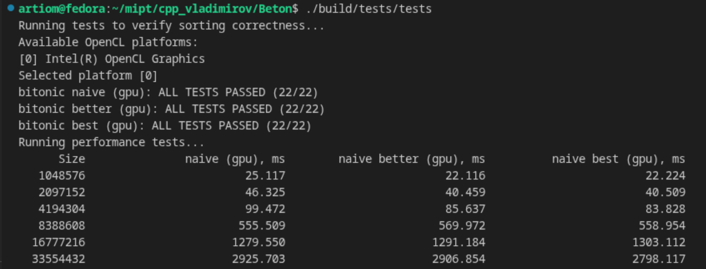

Время примерно одинаковое... Что-ж, давайте профилировать и узнавать в чём дело.

Использованный профилировщик: [Intel Vtune Profiler](https://www.intel.com/content/www/us/en/developer/tools/oneapi/vtune-profiler-download.html)

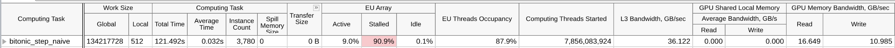
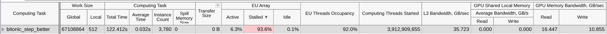
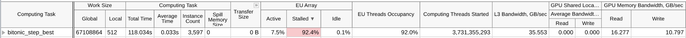

Профилировщик тоже показывает, что все три реализации практически ничем не отличаются. И красным тексом подсказывает нам, что >90% времени EU находятся в состоянии stalled, то есть ничего не делают и ожидают подгрузку памяти. А значит никакие оптимизации вычислений нам не помогут, ведь большую часть времени мы тратим на простой и ожидание подгрузки памяти. 

Таким образом, мы переходим к следующему этапу: чтобы сократить время ожидания данных, используем в нашем алгоритме локальную память видеокарты.

## Реализация с использованием локальной памяти на GPU
