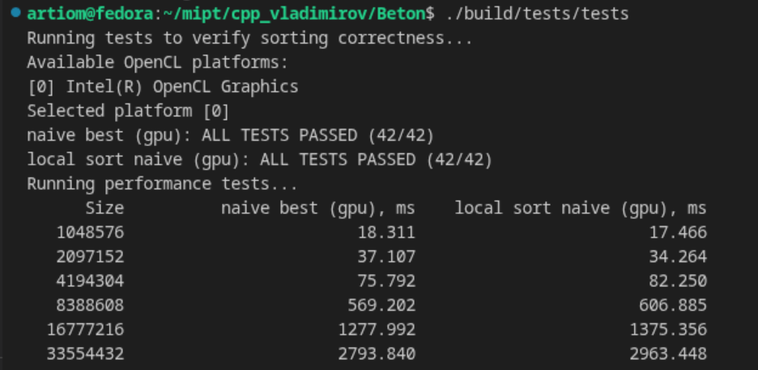
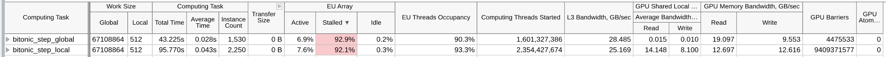
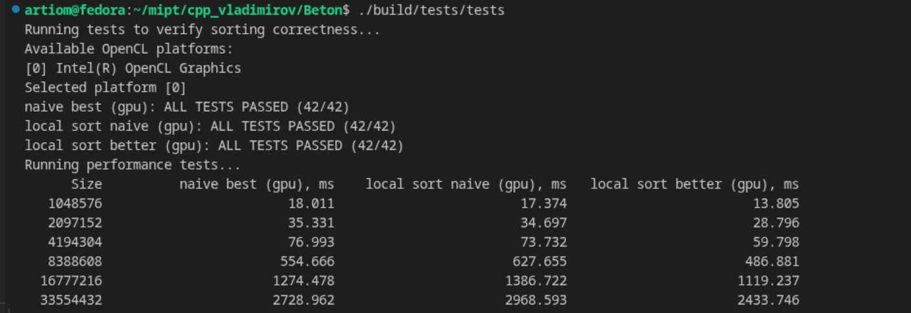
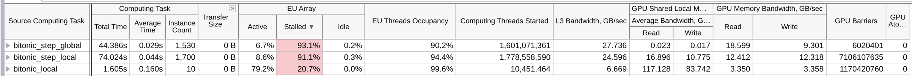
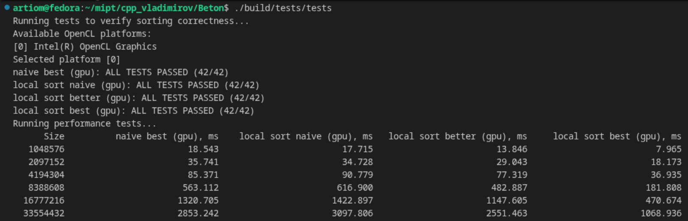
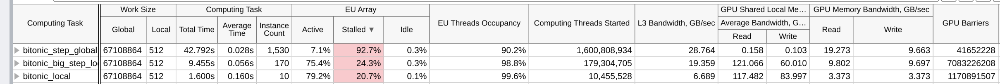
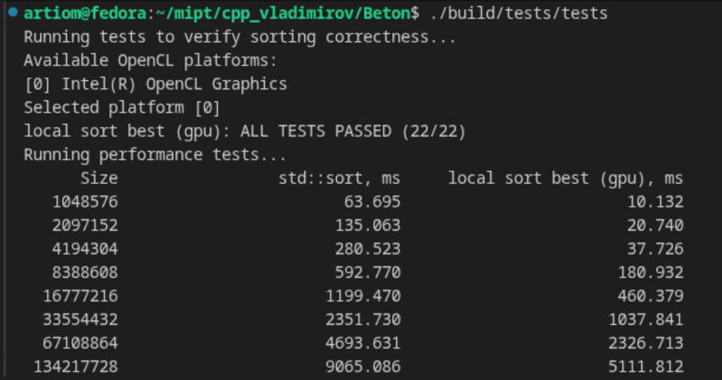

# Битоническая сортировка на OpenCL

## Содержание

- [Введение](#введение)
- [Реализация на CPU](#реализация-на-cpu)
- [Наивная релизация на GPU](#наивная-реализация-на-gpu)
- [Реализация с использованием локальной памяти на GPU](#реализация-с-использованием-локальной-памяти-на-gpu)
- ["Продвинутый" алгоритм на GPU](#продвинутый-алгоритм-на-gpu)
- [Сравнение с std::sort](#сравнение-с-stdsort)
- [Выводы](#выводы)

## Введение

### Характеристики тестирующего оборудования

OS: Fedora Linux 43 (Workstation Edition) x86_64

CPU: 13th Gen Intel(R) Core(TM) i5-13500H (16) @ 4.70 GHz

GPU: Intel Iris Xe Graphics @ 1.45 GHz [Integrated] (Local Memory: 64kb, Max workgroup size: 512)

Memory: 15.24 GiB

### Использованные утилиты

Профилировщик [Perf](https://perfwiki.github.io/main/)

Профилировщик [Intel Vtune Profiler](https://www.intel.com/content/www/us/en/developer/tools/oneapi/vtune-profiler-download.html)

### Об алгоритме

В этой работе мы хотим реализовать алгоритм битонической сортировки на GPU. 

Алгоритм основан на сортировке битонических последовательностей. Такой последовательностью называется последовательность, которая сначала монотонно не убывает, а затем монотонно не возрастает. 


На рисунке изображена битонная сортировочная сеть для 16 элементов, которая сортирует множество по возрастанию. Стрелки изображают компараторы, которые сравнивают два числа и при необходимости меняют их местами таким образом, чтобы направление стрелки указывало на большее число.

Прежде чем читать дальше, полезно понять, как работает этот алгоритм. Приятного прочтения!

## Реализация на CPU

### Рекурсия
Перед тем, как реализовывать сортировку на GPU, мы решили разобраться в самом алгоритме. Первым шагом была рекурсивная реализация алгоритма на CPU.

```cpp
void cpu_comp_and_swap(int& first, int& second, Direction direction)
{
    if ((first > second) == (direction == Direction::Ascending)) { std::swap(first, second); }
}

void cpu_merge(std::vector<int>::iterator begin, std::vector<int>::iterator end,
               Direction direction)
{
    std::ptrdiff_t size = end - begin;
    if (size <= 1) { return; }

    std::ptrdiff_t half = size / 2;

    for (std::ptrdiff_t i = 0; i < half; ++i)
    {
        cpu_comp_and_swap(begin[i], begin[half + i], direction);
    }

    cpu_merge(begin, begin + half, direction);
    cpu_merge(begin + half, end, direction);
}

void cpu_sort_recursive(std::vector<int>::iterator begin, std::vector<int>::iterator end,
                        Direction direction)
{
    std::ptrdiff_t size = end - begin;
    if (size <= 1) { return; }

    std::ptrdiff_t half = size / 2;

    cpu_sort_recursive(begin, begin + half, Direction::Ascending);
    cpu_sort_recursive(begin + half, end, Direction::Descending);

    cpu_merge(begin, end, direction);
}
```

Этот несложный код помог разобраться в самом алгоритме и дальше мы начали думать о том, как безболезненно переложить алгоритм с CPU на GPU.

### Итеративная (наивная)

Так как рекурсия в OpenCL не поддерживается, следующим очевидным шагом стало написание итеративной версии сортировки.

```cpp
void cpu_comp_and_swap(int& first, int& second, Direction direction)
{
    if ((first > second) == (direction == Direction::Ascending)) { std::swap(first, second); }
}

void cpu_sort_iterative_0(std::vector<int>::iterator begin, std::vector<int>::iterator end,
                          Direction direction)
{
    std::ptrdiff_t size = end - begin;
    if (size <= 1) { return; }

    for (std::size_t block_size = 2; block_size <= size; block_size *= 2)
    {
        for (std::size_t dist = block_size / 2; dist > 0; dist /= 2)
        {
            for (std::size_t pos = 0; pos < size; ++pos)
            {
                std::size_t partner = pos ^ dist;
                if (partner > pos)
                {
                    bool use_original_direction = (pos & block_size) == 0;
                    Direction local_direction = use_original_direction ? direction : !direction;

                    details::cpu_comp_and_swap(begin[pos], begin[partner], local_direction);
                }
            }
        }
    }
}
```

Приведу некоторые пояснения по нетривиальным моментам:

1) ```for (std::size_t block_size = 2; block_size <= size; block_size *= 2)```

На начальном этапе каждый элемент массива можно рассматривать как отдельную битоническую последовательность длиной 1, которая одновременно является и возрастающей, и убывающей. Мы хотим слить имеющиеся битонические последовательности в новые последовательности длины 2, потом 4 и так далее.
Таким образом, block_size показывает размер битонической последовательности, которую мы хотим получить в результате слияния.

2) ```for (std::size_t dist = block_size / 2; dist > 0; dist /= 2)```

Этот цикл реализует процесс слияния битонических последовательностей в битонические последовательности большего размера. dist определяет расстояние между элементами, которые мы сравниваем и меняем местами на текущем шаге.

3) ```for (std::size_t pos = 0; pos < size; ++pos)```

Этот цикл проходит по всем элементам массива и для каждой позиции определяет, нужно ли выполнить обмен на текущем этапе слияния.

4) ```std::size_t partner = pos ^ dist;```

partner - индекс элемента, с которым мы хотим сравнить (и, возможно, обменять) элемент с индексом pos.

Почему xor? 
xor гарантирует, что pos и partner находятся в одном блоке размера $dist * 2$, при этом они расположены на расстоянии dist друг от друга:

Если бит на позиции dist в pos равен 0 (первая половина блока), то xor устанавливает его в 1, что эквивалентно сложению: ```partner = pos + dist```

Если бит равен 1 (вторая половина блока), то xor сбрасывает его в 0, что эквивалентно вычитанию: ```partner = pos - dist```

5) ```if (partner > pos)```

Если в предыдущем шаге мы попали в ситуацию ```partner = pos - dist```, то эта ситуация уже обрабатывалась ранее, а значит нет смысла сравнивать эти элементы снова.

6) ```bool use_original_direction = (pos & block_size) == 0;```

Так как мы хотим получить битоническую последовательность в результате слияния, мы должны чередовать направление сортировки. 
Например, если мы сортируем массив в порядке возрастания, то первые две битонические последовательности нужно слить в одну возрастающую, вторые две - в одну убывающую, потом снова в возрастающую и так далее.

Почему "побитовое и"?
Бит, соответствующий ```block_size``` (```block_size``` является степенью двойки), делит весь массив на чередующиеся зоны размера ```block_size```:

Если бит равен 0: элемент находится в первой части объединяемого блока. Здесь мы сохраняем исходное направление ```direction```.

Если бит равен 1: Элемент находится во второй части. Здесь мы должны инвертировать направление (```!direction```), чтобы эта часть была отсортирована противоположно первой.

### Сравнение

В целом, получившийся алгоритм уже можно было переложить на OpenCL, но перед этим мы заметили странную, на первый взгляд, вещь. Почему-то наша итеративная сортировка работала медленнее, чем рекурсивная.


Обычно итеративные варианты алгоритмов работают быстрее рекурсивных из-за накладных расходов на рекурсию, это нас и насторожило! Поэтому мы начали профилировать, используя [Perf](https://perfwiki.github.io/main/).

Perf запускался со следующими флагами:
```sh
perf stat -e cpu_core/cycles/,cpu_core/instructions/,cpu_core/branches/,cpu_core/branch-misses/,cpu_core/cache-references/,cpu_core/cache-misses/ --repeat=5 <путь_до_исходника>
```

Профиль рекурсивной реализации:


Профиль итеративной реализации:


Нетрудно заметить, что количество тактов процессора, инструкций и ветвлений заметно увеличилось. Мы сделали предположение, что во всем виновата вот эта проверка: ```if (partner > pos)```. Действительно, может быть мы можем избежать лишнего перебора тех индексов ```pos```, для которых индекс ```partner``` меньше? Таким образом мы пришли к следующему итеративному варианту.

### Итеративная (без лишнего перебора)

```cpp
void cpu_sort_iterative_1(std::vector<int>::iterator begin, std::vector<int>::iterator end,
                        Direction direction)
{
    std::ptrdiff_t size = end - begin;
    if (size <= 1) { return; }

    for (std::size_t block_size = 2; block_size <= size; block_size *= 2)
    {
        for (std::size_t dist = block_size / 2; dist > 0; dist /= 2)
        {
            for (std::size_t block_idx = 0; block_idx < size / dist; block_idx += 2)
            {
                for (std::size_t pos = block_idx * dist; pos < block_idx * dist + dist; ++pos)
                {
                    std::size_t partner = pos ^ dist;

                    bool use_original_direction = (pos & block_size) == 0;
                    Direction local_direction = use_original_direction ? direction : !direction;

                    details::cpu_comp_and_swap(begin[pos], begin[partner], local_direction);
                }
            }
        }
    }
}
```

Теперь мы перебираем не все индексы ```pos```, а только те, для которых ```partner``` больше ```pos``` (которых ровно в  2 раза меньше!!!). Таким образом мы избавились от ```if```, но приобрели новый ```for```.

Тем не менее, алгоритм заметно ускорился:


Профиль новой реализации:


Количество тактов процессора и ветвлений теперь стало примерно такое же, как и в рекурсивной реализации, чему мы конечно же очень радуемся. 

Но тут же сталкиваемся с новой проблемой. Если в изначальном итеративном варианте мы могли внутренний цикл (по ```pos```) заменить на kernel и очень приятно получить версию для GPU, то в новом варианте мы получили два цикла, и не очень понятно что с ними делать. 

Попытаемся свернуть два цикла в один.

### Итеративная (с одним циклом)

Давайте попробуем проитерировать pos от ```0``` до ```array_size / 2```, а потом пересчитать pos так, чтобы покрыть весь массив, и причем только те части, в которых ```pos``` < ```partner```.

```cpp
void cpu_sort_iterative_2(std::vector<int>::iterator begin, std::vector<int>::iterator end,
                          Direction direction)
{
    std::ptrdiff_t size = end - begin;
    if (size <= 1) { return; }

    int dir = static_cast<int>(direction);

    for (std::size_t block_size = 2; block_size <= size; block_size *= 2)
    {
        for (std::size_t dist = block_size / 2; dist > 0; dist /= 2)
        {
            for (std::size_t pos = 0; pos < size / 2; ++pos)
            {
                std::size_t block_index = pos / dist;
                std::size_t correct_pos = pos + block_index * dist;

                std::size_t partner = correct_pos ^ dist;

                bool use_reversed_direction = (correct_pos & block_size) != 0;
                int local_direction = dir ^ use_reversed_direction;

                details::cpu_comp_and_swap(begin[correct_pos], begin[partner], local_direction);
            }
        }
    }
}
```

Теперь кажется, что эту реализацию можно очень удобно переложить на GPU. Поэтому дополнительно уберем ветвление при выборе ```local_direction```, используя ```xor```.

Измерив время на всякий случай... получим интересные результаты:


Время алгоритма опять увеличилось. Давайте соберем профиль и попробуем понять, что же не так.

Профиль:


Видно, что количество тактов и инструкций увеличилось по сравнению с предыдущим вариантом. Наверное, единственное, из-за чего это могло произойти - новые инструкции в пересчёте ```pos```:

```cpp
std::size_t block_index = pos / dist;
std::size_t correct_pos = pos + block_index * dist;
```

Мы видим умножение и деление, которые являются непростыми инструкциями для процессора. Попробуем заменить их.

### Итеративная (итог)

Теперь будем итерироваться не по абсолютным значениям, а по степеням двойки, чтобы умножение и деление заменить на сдвиги, которые значительно быстрее.

Получим такую интересную функцию (к сожалению, менее приятную для чтения, чем изначально)

```cpp
void cpu_sort_iterative_3(std::vector<int>::iterator begin, std::vector<int>::iterator end,
                          Direction direction)
{
    std::ptrdiff_t size = end - begin;
    if (size <= 1) { return; }

    std::size_t size_log = log2(size);

    int dir = static_cast<int>(direction);

    for (std::size_t block_size_log = 1; block_size_log <= size_log; block_size_log += 1)
    {
        std::size_t block_size = 1ul << block_size_log;

        for (int dist_log = block_size_log - 1; dist_log >= 0; dist_log -= 1)
        {
            std::size_t dist = 1ul << dist_log;
            
            for (std::size_t pos = 0; pos < size / 2; ++pos)
            {
                std::size_t block_index = pos >> dist_log;
                std::size_t correct_pos = pos + (block_index << dist_log);

                std::size_t partner = correct_pos ^ dist;

                bool use_reversed_direction = (correct_pos & block_size) != 0;
                int local_direction = dir ^ use_reversed_direction;

                details::cpu_comp_and_swap(begin[correct_pos], begin[partner], local_direction);
            }
        }
    }
}
```

И действительно, наша оптимизация уменьшила общее количество тактов процессора:


Измерив время работы каждой из предыдущих функций получим такой результат:


Итоговая функция ```cpu_sort_iterative_3``` работает сравнимо по скорости с функцией ```cpu_sort_iterative_1``` (с двумя циклами), но итоговый вариант можно намного приятнее переложить на GPU, в отличие от версии с двумя циклами.

Займёмся этим!

## Наивная реализация на GPU

Интересно будет написать три варианта наивной сортировки на GPU, аналогичные cpu_sort_iterative_0, cpu_sort_iterative_2, cpu_sort_iterative_3 и сравнить их по производительности. Действительно ли полезными оказались придуманные оптимизации?

Для удобства приводим таблицу с основными отличиями:

| Функция              | Количество if на каждую итерацию цикла | Сложные вычисления |
|----------------------|----------------------------------------|--------------------|
| cpu_sort_iterative_0 | 3                                      | Нет                |
| cpu_sort_iterative_2 | 1                                      | Да                 |
| cpu_sort_iterative_3 | 1                                      | Нет                |

Кернела на OpenCL и хостовый код практически ничем не будут отличаться от итеративных функий, но для полноты приведу код трёх получившихся кернелов, которые заменяют внутренний цикл по ```pos```.

Кернел, аналогичный ```cpu_sort_iterative_0```:
```cpp
__kernel void bitonic_step_naive(__global int* array, const uint block_size, const uint dist,
                                 int direction)
{
    uint pos = get_global_id(0);

    uint partner = pos ^ dist;
    if (partner < pos) { return; }

    int use_reversed_direction = (pos & block_size) != 0;
    int local_direction = direction ^ use_reversed_direction;

    COMP_AND_SWAP(array[pos], array[partner], local_direction);
}
```

Кернел, аналогичный ```cpu_sort_iterative_2```:
```cpp
__kernel void bitonic_step_better(__global int* array, const uint block_size, const uint dist,
                                  int direction)
{
    uint pos = get_global_id(0);

    uint block_index = pos / dist;
    pos += block_index * dist;

    uint partner = pos ^ dist;

    int use_reversed_direction = (pos & block_size) != 0;
    int local_direction = direction ^ use_reversed_direction;

    COMP_AND_SWAP(array[pos], array[partner], local_direction);
}
```

Кернел, аналогичный ```cpu_sort_iterative_3```:
```cpp
__kernel void bitonic_step_best(__global int* array, const uint block_size,
                                const uint block_size_log, const uint dist_log, int direction)
{
    uint pos = get_global_id(0);

    uint dist = 1ul << dist_log;

    uint block_index = pos >> dist_log;
    pos += block_index << dist_log;

    uint partner = pos ^ dist;

    int use_reversed_direction = (pos & block_size) != 0;
    int local_direction = direction ^ use_reversed_direction;

    COMP_AND_SWAP(array[pos], array[partner], local_direction);
}
```

Сравнив скорость работы этих трёх реализаций, можно убедиться, что... 


Время примерно одинаковое... Что-ж, давайте профилировать и узнавать в чём дело.

Использованный профилировщик: [Intel Vtune Profiler](https://www.intel.com/content/www/us/en/developer/tools/oneapi/vtune-profiler-download.html)


Профилировщик тоже показывает, что все три реализации практически ничем не отличаются. И красным тексом подсказывает нам, что >90% времени EU находятся в состоянии stalled, то есть ничего не делают и ожидают подгрузку памяти. А значит никакие оптимизации вычислений нам не помогут, ведь большую часть времени мы тратим на простой и ожидание подгрузки памяти. 

Таким образом, мы переходим к следующему этапу: чтобы сократить время ожидания данных, используем в нашем алгоритме локальную память видеокарты.

## Реализация с использованием локальной памяти на GPU

Давайте напишем самый наивный вариант функции и будем постепенно его оптимизировать. 

Начнем с такой реализации: давайте, если на этапе битонической сортировки расстояние между сравниваемыми элементами (`dist`) становится достаточно малым (а конкретно меньше или равно размеру ворк группы), будем использовать локальную память. То есть, если максимальный размер ворк группы равен $512$, то в локальную память мы загрузим $512 * 2$ элемента, так как каждый ворк айтем обрабатывает элементы с индексами `pos` и `partner`. 

Если `dist` больше, то будем использовать глобальную память.

```cpp
void gpu_local_sort_naive(std::vector<int>::iterator begin, std::vector<int>::iterator end,
                          Direction direction)
{
    // ...

    cl::Kernel kernel_global(bitonic_sort_program, "bitonic_step_global");
    cl::Kernel kernel_local(bitonic_sort_program, "bitonic_step_local");

    cl::size_type max_workgroup_size = device.getInfo<CL_DEVICE_MAX_WORK_GROUP_SIZE>();

    cl::NDRange global_range(array_size / 2);
    cl::NDRange local_range(max_workgroup_size);

    for (cl_uint block_size = 2; block_size <= array_size; block_size *= 2)
    {
        for (cl_uint dist = block_size / 2; dist > 0; dist /= 2)
        {
            if (dist <= max_workgroup_size)
            {
                kernel_local.setArg(0, array);
                kernel_local.setArg(1, cl::Local(max_workgroup_size * 2 * sizeof(int)));
                kernel_local.setArg(2, block_size);
                kernel_local.setArg(3, dist);
                kernel_local.setArg(4, dir);

                command_queue.enqueueNDRangeKernel(kernel_local, cl::NullRange, global_range,
                                                   local_range);
            }

            else
            {
                kernel_global.setArg(0, array);
                kernel_global.setArg(1, block_size);
                kernel_global.setArg(2, dist);
                kernel_global.setArg(3, dir);

                command_queue.enqueueNDRangeKernel(kernel_global, cl::NullRange, global_range,
                                                   local_range);
            }
        }
    }

    // ...
}
```

Тут ```bitonic_step_global``` - это кернел из предыдущего пункта, а ```bitonic_step_local``` представлен ниже.

```cpp
__kernel void bitonic_step_local(__global int* g_data, __local int* l_data, const uint block_size,
                                 const uint dist, int direction)
{
    uint group_size = get_local_size(0);
    uint global_offset = get_group_id(0) * (group_size * 2);

    uint lid = get_local_id(0);

    l_data[lid] = g_data[global_offset + lid];
    l_data[lid + group_size] = g_data[global_offset + lid + group_size];

    barrier(CLK_LOCAL_MEM_FENCE);


    uint pos = get_local_id(0);

    uint block_index = pos / dist;
    pos += block_index * dist;

    uint partner = pos ^ dist;

    uint global_pos = pos + global_offset;

    int use_reversed_direction = (global_pos & block_size) != 0;
    int local_direction = direction ^ use_reversed_direction;

    COMP_AND_SWAP(l_data[pos], l_data[partner], local_direction);


    barrier(CLK_LOCAL_MEM_FENCE);

    g_data[global_offset + lid] = l_data[lid];
    g_data[global_offset + lid + group_size] = l_data[lid + group_size];
}
```

То есть этот кернел ничем не отличается от ```bitonic_step_global```, кроме как того, что мы дополнительно загружаем данные в локальную память (обратите внимание, что доступ к памяти coalesced).

Сравним производительность с предыдущей реализацией без локальной памяти:



Добавили локальную память и упала скорость =(

Давайте проанализируем профиль:



На первый взгляд ничего не понятно, но если приглядеться, то мы видим ~9 МЛРД БАРЬЕРОВ. Видимо затраты на синхронизацию оказались настолько высокими, что даже локальная память нам никак не помогла (и даже ухудшила положение дел).

Подумав как можно исправить это недоразумение мы приходим к выводу, что можно попробовать некоторые кернела обьединить в один. И действительно, если `block_size < workgroup_size * 2`, то есть block_size помещается в локальную память, тогда можно сделать так:

```cpp
__kernel void bitonic_local(__global int* g_data, __local int* l_data, int direction)
{
    int group_size = get_local_size(0);
    int global_offset = get_group_id(0) * (group_size * 2);

    int lid = get_local_id(0);

    l_data[lid] = g_data[global_offset + lid];
    l_data[lid + group_size] = g_data[global_offset + lid + group_size];

    barrier(CLK_LOCAL_MEM_FENCE);

    int limit = group_size * 2;

    for (int block_size = 2; block_size <= limit; block_size *= 2)
    {
        for (int dist = block_size / 2; dist > 0; dist /= 2)
        {
            uint pos = lid;

            uint block_index = pos / dist;
            pos += block_index * dist;

            uint partner = pos ^ dist;

            uint global_pos = pos + global_offset;

            uint use_reversed_direction = (global_pos & block_size) != 0;
            int local_direction = direction ^ use_reversed_direction;

            COMP_AND_SWAP(l_data[pos], l_data[partner], local_direction);

            barrier(CLK_LOCAL_MEM_FENCE);
        }
    }

    g_data[global_offset + lid] = l_data[lid];
    g_data[global_offset + lid + group_size] = l_data[lid + group_size];
}
```

Использовать этот кернел будем так:

```cpp

void gpu_local_sort_better(std::vector<int>::iterator begin, std::vector<int>::iterator end,
                           Direction direction)
{
    // ...

    cl::Kernel kernel_global(bitonic_sort_program, "bitonic_step_global");
    cl::Kernel kernel_local(bitonic_sort_program, "bitonic_local");
    cl::Kernel kernel_local_step(bitonic_sort_program, "bitonic_step_local");

    cl::size_type max_workgroup_size = device.getInfo<CL_DEVICE_MAX_WORK_GROUP_SIZE>();

    cl::NDRange global_range(array_size / 2);
    cl::NDRange local_range(max_workgroup_size);

    cl_uint elems_per_workgroup = max_workgroup_size * 2;


    kernel_local.setArg(0, array);
    kernel_local.setArg(1, cl::Local(elems_per_workgroup * sizeof(int)));
    kernel_local.setArg(2, dir);

    command_queue.enqueueNDRangeKernel(kernel_local, cl::NullRange, global_range, local_range);


    for (cl_uint block_size = elems_per_workgroup * 2; block_size <= array_size; block_size *= 2)
    {
        for (cl_uint dist = block_size / 2; dist > 0; dist /= 2)
        {
            if (dist <= max_workgroup_size)
            {
                kernel_local_step.setArg(0, array);
                kernel_local_step.setArg(1, cl::Local(elems_per_workgroup * sizeof(int)));
                kernel_local_step.setArg(2, block_size);
                kernel_local_step.setArg(3, dist);
                kernel_local_step.setArg(4, dir);

                command_queue.enqueueNDRangeKernel(kernel_local_step, cl::NullRange, global_range,
                                                   local_range);
            }

            else
            {
                kernel_global.setArg(0, array);
                kernel_global.setArg(1, block_size);
                kernel_global.setArg(2, dist);
                kernel_global.setArg(3, dir);

                command_queue.enqueueNDRangeKernel(kernel_global, cl::NullRange, global_range,
                                                   local_range);
            }
        }
    }

    // ...
}

```

Снова сравним время с предыдущими результатами:



И профиль:



И время немного улучшилось, и на один миллиард барьеров стало меньше, ура!

Но может быть можно еще какие-нибудь кернела слить в один? И действительно можно.

Как только `dist` становится не больше, чем `workgroup_size`, дальше он будет только уменьшаться, а значит мы и подавно сможем отсортировать это в локальной памяти. Так давайте все итерации `dist` от `workgroup_size` до $0$ сольем в один кернел.

Получим следующее: 

```cpp

void gpu_local_sort_best(std::vector<int>::iterator begin, std::vector<int>::iterator end,
                         Direction direction)
{
    // ...

    cl::Kernel kernel_global(bitonic_sort_program, "bitonic_step_global");
    cl::Kernel kernel_local(bitonic_sort_program, "bitonic_local");
    cl::Kernel kernel_local_step(bitonic_sort_program, "bitonic_big_step_local");

    cl::size_type max_workgroup_size = device.getInfo<CL_DEVICE_MAX_WORK_GROUP_SIZE>();

    cl::NDRange global_range(array_size / 2);
    cl::NDRange local_range(max_workgroup_size);

    cl_uint elems_per_workgroup = max_workgroup_size * 2;


    kernel_local.setArg(0, array);
    kernel_local.setArg(1, cl::Local(elems_per_workgroup * sizeof(int)));
    kernel_local.setArg(2, dir);

    command_queue.enqueueNDRangeKernel(kernel_local, cl::NullRange, global_range, local_range);


    for (cl_uint block_size = elems_per_workgroup * 2; block_size <= array_size; block_size *= 2)
    {
        for (cl_uint dist = block_size / 2; dist > max_workgroup_size; dist /= 2)
        {
            kernel_global.setArg(0, array);
            kernel_global.setArg(1, block_size);
            kernel_global.setArg(2, dist);
            kernel_global.setArg(3, dir);

            command_queue.enqueueNDRangeKernel(kernel_global, cl::NullRange, global_range,
                                               local_range);
        }

        kernel_local_step.setArg(0, array);
        kernel_local_step.setArg(1, cl::Local(elems_per_workgroup * sizeof(int)));
        kernel_local_step.setArg(2, block_size);
        kernel_local_step.setArg(3, max_workgroup_size);
        kernel_local_step.setArg(4, dir);

        command_queue.enqueueNDRangeKernel(kernel_local_step, cl::NullRange, global_range,
                                           local_range);
    }

    // ...
}

```

И новый кернел `bitonic_big_step_local` выглядит так:

```cpp

__kernel void bitonic_big_step_local(__global int* g_data, __local int* l_data,
                                     const uint block_size, const uint current_dist, int direction)
{
    int group_size = get_local_size(0);
    int global_offset = get_group_id(0) * (group_size * 2);

    int lid = get_local_id(0);

    l_data[lid] = g_data[global_offset + lid];
    l_data[lid + group_size] = g_data[global_offset + lid + group_size];

    barrier(CLK_LOCAL_MEM_FENCE);


    for (int dist = current_dist; dist > 0; dist /= 2)
    {
        uint pos = lid;

        uint block_index = pos / dist;
        pos += block_index * dist;

        uint partner = pos ^ dist;

        uint global_pos = pos + global_offset;

        uint use_reversed_direction = (global_pos & block_size) != 0;
        int local_direction = direction ^ use_reversed_direction;

        COMP_AND_SWAP(l_data[pos], l_data[partner], local_direction);

        barrier(CLK_LOCAL_MEM_FENCE);
    }


    g_data[global_offset + lid] = l_data[lid];
    g_data[global_offset + lid + group_size] = l_data[lid + group_size];
}

```

МЫ ПОБЕДИЛИ!!!! Эта оптимизация дала прирост в ~2.5 раза, что является огромным успехом!



И профиль:



Отличные показатели по пропускной способности памяти, маленький stall на кернелах, использующих локальную память и крайне высокий occupancy.

## Сравнение с std::sort

Напоследок, давайте порадуемся за наш алгоритм =)




## "Продвинутый" алгоритм на GPU

Данный раздел посвящен тому, что в предыдущих рассуждениях мы использовали локальную память далеко не на весь свой максимум. На тестирующем компьютере, например, размер локальной памяти составляет 64кб, а мы использовали лишь $512 * 2 * sizeof(int) = 4096$ байт. 

Можно придумать алгоритм, в котором каждый work item будет заниматься сразу несколькими элементами (например, 4, 8, ..., 32). 

Даст ли это прирост по времени? Мы пока что не знаем, так как алгоритм получается очень громоздким, нечитаемым и его довольно сложно дебажить. Так что to be continued...

P.S. подробнее про "продвинутый" алгоритм читайте в книжке "OpenCL in action", а наши наработки по этому алгоритму можно посмотреть в ветке `advanced_sort_optimization`.

## Выводы

1) Не оптимизируйте что-либо, если не уверены, что в этом вообще есть смысл. Например, в первой половине нашей работы мы оптимизировали вычисления для алгоритма на CPU, думая, что это поможет и в алгоритме на GPU. Здесь нужно строго разделять compute bound и memory bound алгоритмы. Наш алгоритм оказался memory bound, так что никакие оптимизации вычислений нам не помогли.

2) Профилируйте ВСЕГДА. Данные профилировщика очень хорошо задают правильный вектор для размышлений.

3) Выполняйте оптимизации постепенно. По секрету, мы наступили на эти грабли, потому что первым делом реализовали алгоритм из книжки, упомянутой выше, и вообще не понимали почему там все устроенно именно так, как устроено. Впоследствие, выполняя оптимизации по шагам, мы сами догадались до такой реализации и очень хорошо разобрались откуда вообще взялся такой странный алгоритм.

Спасибо всем, кто дочитал это очень длинное readme до конца! Вы молодцы, удачи)
